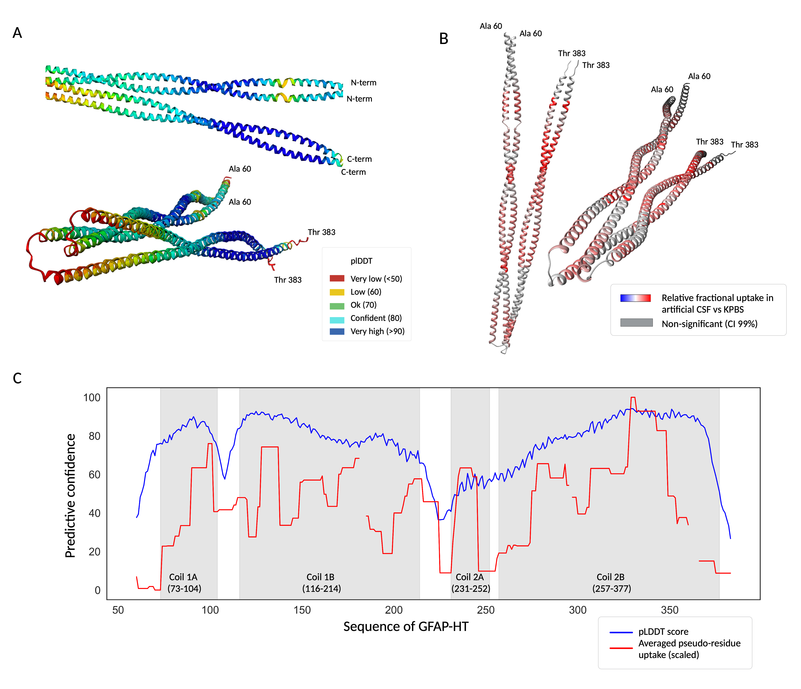

### Chimera figure settings

- GFAP_monomer.pdb is a full-length PDB structure predicted by AlphaFold, that you can download from UniProt. 
- GFAP_HT_Dimer.pdb is a predicted PDB structure of a GFAP-HT dimer from AlphaFold multimer. 
- define_attributes_monomer.txt contains average uptake values (the ones that we use for the pseudo-residue line on the Woods plot, this is aCSF vs KPBS). It is numbered from 60 onward, so it only colours the residues we have in GFAP-HT. 
- define_attributes_dimer.txt This is the same as 3, but numbering starts from 1 since the PDB structure is of GFAP-HT, so we don't have any missing residues here. 

How to use them to create the same figures as in the manuscript: 

- Open the PDB file of the monomer. Then in the upper menu select tools > structure analysis > define attributes and then load the define_attributes_monomer.txt file. It should do the trick. 
- For the dimer structure, you can do the same for both chains. First, select chain A and define attributes, and then the same with chain B. 

Colour settings: 

- The lowest bar (#a762a762a762)
- Middle bar value 1.45463 (#a762a762a762)
- The highest value in red is 5.30778 (#ffff1d8a1d8a)
- No values - (#cec4a2b93f9f)

